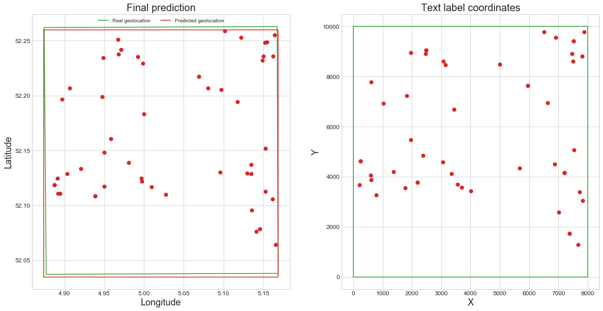

# Automatic Georeferencing of Topographic Raster Maps

Supplementary code for the IJDAR submission: Automatic Georeferencing of Topographic Raster Maps

Note to editors: The code is not final and may be reformatted or cleaned.

# Getting Started

## Installation

**Python >= 3.6 and TensorFlow >= 2.0.0** required for the text recognition part (used [keras-ocr](https://github.com/faustomorales/keras-ocr)), Tensorflow is not required for the geolocation part.

Text recognition:
```python
pip install -r recognition_req.txt
```
Geolocation:
```python
pip install -r geolocation_req.txt
```


## Using

**geolocation.ipynb** presents the code used to geolocate the maps and also the results of each step in the process. This code can be directly run after cloning the repository and installing the requirements. Plots of the final predictions are saved in the plots directory. The full geolocation code and results are viewable in an interactive [notebook](https://colab.research.google.com/drive/16MR1tNWxHv7krZNbSUEITE2XvLQCzlEw?usp=sharing)



**text_recognition_and_geocoding.ipynb** presents sample code to perform text recognition with keras-ocr and geocode the found text labels. These were already processed and the results are saved in the json directory. Pretrained detection and recognition models should be downloaded automatically into the pretrained_models directory.

## Datasets

### TOP50Raster

Full dataset can be downloaded [here](https://www.pdok.nl/downloads/-/article/dataset-basisregistratie-topografie-brt-topraster). Following map sheets were used: 31O, 32W, 32O, 38O, 39W, 39O, 44O, 45W, and 45O. The maps are in the GeoTif format, WGS84 coordinates of the corner points were found with the functions described in **get_wgs84.ipynb** and saved in the json dir. 

### M834 topographic raster maps of Belgium

These 16 maps are subject to copyright and can therefore not be shared publicly. They can be viewed online in [Cartesius](https://www.cartesius.be/CartesiusPortal/), you can search for each of the map's titles. Example for [Lebbeke-Merchtem](http://www.cartesius.be/arcgis/home/webmap/viewer.html?basemapUrl=http://www.ngi.be/tiles/arcgis/rest/services/25k__{C9BA3B31-8EDB-44DA-9F5A-D9884096433D}__default__404000/MapServer&lang=en) and its [metadata](https://www.cartesius.be/geoportal/catalog/search/resource/details.page?uuid=%7B84E5BEFF-D865-43F4-9165-1E6730680249%7D), you might have to use Internet Explorer. 

A full list of the maps used is given below:
* Aalter-Nevele
* Bassevelde-Zelzate
* Dendermonde-Puurs
* Dentergem-Deinze
* Evergem-Lochristi
* Gavere-Oosterzele
* Gent-Melle
* Knesselare-Zomergem
* Langelede-Stekene
* Lebbeke-Merchtem
* Maldegem-Eeklo
* Oordegem-Aalst
* Sint-Gillis-Waas-Beveren
* Sint-Niklaas-Temse
* Wetteren-Zele
* Zeveneken-Lokeren
